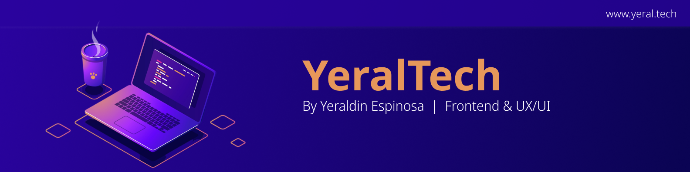

### Hi there 👋, Soy Yeraldin Espinosa
#### Frontend | UX/UI 

Trabaje por varios años en el área de  ventas y decidí hacer una transición al área del Diseño y programación Web centrándome especialmente en diseño UX/UI y Frontend. Mi verdadera motivación surge de un profundo interés por el diseño y la creación de experiencias visuales cautivadoras. Encuentro inspiración en la posibilidad de aportar detalles significativos y construir soluciones que no solo sean funcionales, sino también estéticamente atractivas, para que las personas las utilicen y las disfruten. 

Busco nuevas oportunidades que me desafíen y permitan seguir expandiendo mis conocimientos en el desarrollo web. ¡Estoy lista para aportar mi energía, pasión y habilidades a un equipo dinámico y en constante evolución! 🚀

Herramientas de Diseño:      

Tecnologías:   	   

